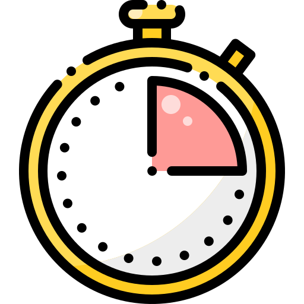

# HECKTOR2025 - Challenge

<p align="center">

</p>

---
<!--
#  Submission Countdown
Animation TBA

---
-->

# ℹ️ About

This repository contains the submission template and instructions for the [Grand Challenge 2025](https://hecktor25.grand-challenge.org/hecktor25/) docker-based inference task. Follow this guide to install Docker, run the baseline inference, observe challenge restrictions, save your container, and prepare your submission.

---
# 📑 Table of Contents

* 🛠️ [Installation](#-installation)
* 🤖 [Baseline Inference](#-baseline-inference)
*  [Restrictions and Submission Tips](#-restrictions-and-submission-tips)
* 💾 [Saving and Uploading Containers](#-saving-and-uploading-containers)

---
# 🛠️ Installation

## Windows

1. Download Docker Desktop for Windows: [https://www.docker.com/products/docker-desktop](https://www.docker.com/products/docker-desktop)
2. Run the installer and follow on-screen instructions.
3. Ensure Docker is running by opening PowerShell and executing:

   ```bash
   docker --version
   ```

## macOS

1. Download Docker Desktop for Mac: [https://www.docker.com/products/docker-desktop](https://www.docker.com/products/docker-desktop)
2. Open the `.dmg` file and drag the Docker app to Applications.
3. Launch Docker and verify:

   ```bash
   docker --version
   ```

## Linux

### Install prerequisites

  As most of the participants might be using Linux, so we provide detailed steps to set-up the docker.
  To create and test your docker setup, you will need to install [Docker Engine](https://docs.docker.com/engine/install/)
  and [NVIDIA-container-toolkit](https://docs.nvidia.com/datacenter/cloud-native/container-toolkit/install-guide.html) (in case you need GPU computation). You can follow the instructions in the links to install the prerequisites on your system. 

- **Docker Engine:** To verify that docker has been successfully installed, please run ```docker run hello-world```

- **Nvidia-container-toolkit:** To verify you can access gpu inside docker by running ```docker run --rm --gpus all nvidia/cuda:12.1.1-runtime-ubuntu22.04 nvidia-smi```

---
# 🤖 Baseline Inference

Below is a structure of the ```template-docker``` branch. We support three separate tasks: **Task1**, **Task2**, and **Task3**. For each task, you should have a separate dedicated model under its folder.

1. **Repository Structure**

   ```text
   ├── Task1/
   │    ├── resources/       # Place your model files here
   │    ├── requirements.txt # Modify only to add new packages
   │    └── ...
   ├── Task2/
   │    ├── resources/
   |    └── ...
   ├── Task3/
   │    ├── resources/
   │    ├── Dockerfile.template # Base Dockerfile for reference
   │    ├── do_build.sh         # Script to build container
   │    ├── do_test_run.sh      # Script to test container locally
   │    ├── do_save.sh          # Script to save container as tarball
   │    └── inference.py        # Entry point: loads models, runs inference
   |    └── ...
   ```

2. **Model Files and Packages**

    * Place all model weights, configuration files, or auxiliary code inside the `resources/` folder of the corresponding Task directory as this is the only directory where you can place your supporting files.
    * You **may** update `requirements.txt` within each Task folder to install any additional Python packages needed by your model.

3. **Working Directory**

    * All input and output files during inference must be read from or written to the `/tmp/` directory inside the container.

4. **Build the Container**
   * To build your container, you can run ```do_build.sh``` file.
   ```bash
   # From repo root
   ./do_build.sh           # builds an image tagged `challenge:<branch>`
   ```

5. **Local Test Run**
    * The ```do_test_run.sh``` file can be used to test the container on local machines before submitting the finalized version. 
   ```bash
   # Runs inference locally mounting /tmp data
   ./do_test_run.sh
   ```

6. **Save Container**
    * You can use ```do_save.sh``` file to save your docker container.
   ```bash
   ./do_save.sh
   ```

7. **Performing Inference**

    * `inference.py` is the entry point script executed at container runtime. You can implement or call your model-loading and prediction code here.


   <!-- * Inputs must mount to `/tmp/images`
   * Outputs will be written to `/tmp/output` -->

<!-- # Restrictions and Submission Tips

* **No network access**: All downloads must occur before container startup.
* **No GPU**: Inference runs on CPU only.
* **I/O paths**: Read inputs only from `/tmp/images` and write outputs only to `/tmp/output`.
* **Time limit**: Entire inference must finish within **30 minutes**.
* **File writes**: Do not create or modify files outside `/tmp` -->

#  Grand Challenge Restrictions & Submission Tips

This section is to guide participants through the [submission tips](https://grand-challenge.org/documentation/making-a-challenge-submission/#submission-tips) documentation. This includes important information like:

1. **Algorithm Submission**
   - You do not need to create a new algorithm for each submission.
   - If you update your algorithm, don't forget to make a new submission to the challenge with it, this will not happen automatically. For more guidelines on how to creat a submission on Grand-Challenge and upload your algorithm, please follow the intructions [here](submission-guidelines.md)

2. **Offline Execution Only**  
  Your container **must not** attempt any network access (HTTP, SSH, DNS, etc.). Any outgoing connection will cause automatic disqualification.

3. **Computational & Memory Constraints**  
    - **GPU**: Your code will run on NVIDIA T4 Tensor Core GPU with 16 GB VRAM. Please design the model so that it should be able to execute on this GPU.  
    - **Memory Limit**: Peak RAM usage must stay under **16 GB**.
    - **Docker Size**:  The container you upload for your algorithm cannot exceed 10GB.

4. **Filesystem Write Permissions**  
   All writes (models, logs, outputs) **must** go under `/tmp/`. Writing elsewhere on the filesystem will be ignored or blocked. 

5. **I/O Interface**  
    - **Input**: read exclusively from `/input/`  
    - **Output**: write exclusively to `/output/`  
    - **No Extra Files**: do not generate caches or logs in other directories.

6. **Time Limit**  
   Tasks 1 and 3 have a **10-minute** wall-clock limit, while task 2 has a **15-minute** limit. Any process running longer will be force-terminated.

7. **Submission Tips**  
    - **Local Validation**: always run `./do_test_run.sh` before packing.  
    - **Save Your Container**: use `./do_save.sh` to generate a `<task>_submission.tar.gz` (max **2 GB**).  
    - **Naming Convention**: name archives as `submission_task1.tar.gz`, `submission_task2.tar.gz`, etc.  
    - **Double-Check**: ensure `TaskX/resources/` contains all model artifacts and updated `requirements.txt`.

8. **Common Error Messages**  
   | Error Text                          | Likely Cause                                    | Fix                                 |
   |-------------------------------------|-------------------------------------------------|-------------------------------------|
   | `Model file not found`              | Missing weights in `TaskX/resources/`           | Add your `.pth`/`.onnx` files       |
   | `ModuleNotFoundError: …`            | Dependency not declared                         | Update `requirements.txt` & rebuild |
   | `Permission denied: '/some/path'`   | Writing outside `/tmp/`                         | Redirect writes to `/tmp/`          |
   | `Killed` or `OOM`                   | Exceeded memory limit                           | Reduce batch size or model footprint|
   | `Timeout`                           | Exceeded runtime limit | Optimize preprocessing/inference    |

---


# 💾 Saving and Uploading Containers

<!-- 1. **Commit the running container** (after testing):

   ```bash
   CONTAINER_ID=$(docker ps -lq)
   docker commit $CONTAINER_ID submission-image
   ``` -->

1. **Save to tarball**:

   ```bash
   ./do_save.sh
   ```

2. **Upload to Sanity Check**:

   In the HECKTOR challenge, we have three tasks (`Task 1 - Detection and Segmentation`, `Task 2 - Prognosis`, and `Task 3 - Classification`) and for each task, participants compete in three phases. So here, the task submission is divided into 3 phases:

    - **Sanity Check Phase:** Consists of 3 images to ensure participants are familiar with the Grand Challenge platform and that their dockers run without errors. All teams must make their submission to this phase and will receive feedback on any errors.
    - **Validation Phase:** Consists of approximately 50 images. All teams will submit up to 2 working dockers from the sanity check to this phase. Only the top 15 teams, as ranked by the evaluation metrics displayed on the public validation leaderboard, with valid submissions will proceed to Phase 3.
    - **Testing Phase:** Consists of approximately 400 images. The teams will choose 1 of their 2 dockers from the validation phase to be submitted to the testing phase. The official ranking of the teams will be based solely on the testing phase results.


  > **NOTE:** The participants will not receive detailed feedback during the testing phase except for error notifications.

  We also provided some of the requirements for the submission to be valid which can be found on the [Submission webpage](https://hecktor25.grand-challenge.org/submission-instructions/). To start with your submission, for each task on either phases, login to the [Grand Challenge](https://hecktor25.grand-challenge.org/) and click on the link [here](https://hecktor25.grand-challenge.org/evaluation/sanity-check-task-1/submissions/create/). In order to proceed with the submission, please do make sure to follow the guidelines given in ["Submission Guidelines"](https://github.com/BioMedIA-MBZUAI/HECKTOR2025/blob/main/doc/submission-guidelines.md) with visual examples:

  <p align="center">
  
  </p>

  On the top region, you can select for which phase and task you are submitting your method. Assuming that we want to test it for the Task 1 on the **Sanity Check Phase**, we select the "**Sanity Check - Task 1**" tab and select the uploaded algorithm from the drop-down list as shown below:

  <p align="center">
  
  </p>

  Finally, by clicking on the "**Save**" button you will submit your algorithm for evaluation on the challenges task. The process is the same for all the tasks and phases.

   * Log in to the challenge portal.
   * Navigate to **My Submissions** → **Upload Container**.
   * Select `my_submission.tar` and submit.

---
# 🎉 Good luck with your submission!
* **Support**: Post questions on the [Challenge Forum](https://grand-challenge.org/forums/forum/head-and-neck-tumor-lesion-segmentation-diagnosis-and-prognosis-767/) under **Forum** tab or send an email at ```hecktor.challenge@gmail.com```.